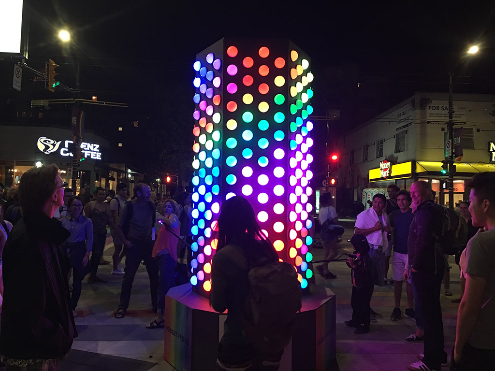
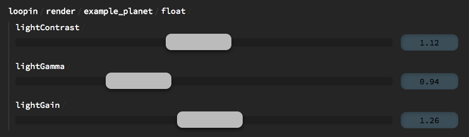

Loopin is a free, open-source visual creative coding system. The Loopin stack allows you to create and deploy simple, GPU-driven applications with built-in web-based controls.

Loopin is an on-going experiment, but has deployed with high success in several pieces of illuminated art.

Loopin is the brain child of Vancouver-based creative technologist **Samm Zuest Cooper**, in association with [HFour Design Studio](http://hfour.ca/).

# Requirements

A properly developerized **Mac** or **Linux** machine for development, and optionally a **Raspberry Pi** deployment. ***Windows*** *is not supported at the time.*

Knowledge of the following languages, or a willingness to learn, should be considered prerequisite to Loopin use:

- **GLSL** : Shader code. This is where the magic happens.
- **YAML** : Patches and presets, controlling the structure of Loopin applications.
- **Markdown** : Control configuration and documentation.  
- **node.js** : Project boilerplate and higher level logic.

# Getting Started

The [loopin-starter](https://github.com/koopero/loopin-starter) project contains all the boilerplate needed to start building a Loopin application, as well as a cool, well documented example project.

# Stack

Loopin is a multi-tiered system, consisting of several loosely-coupled modules:

[loopin](https://github.com/koopero/loopin) ( root project ) contains node.js code to orchestrate

[loopin-native](https://github.com/koopero/loopin-native) implements a low-level, natively compiled rendering machine named `ofxLoopin`.

[loopin-server](https://github.com/koopero/loopin-server) delivers a RESTful interface to Loopin internals.

[horten-control](https://github.com/koopero/horten-control) implements an expressive, realtime, easy to use web based control system for Loopin applications.  

# Gallery

[Nympheas Generative Painting](http://hfour.ca/portfolio-item/nympheas-generative-painting/) by [HFour Design Studio](http://hfour.ca/). Loopin used to create an interactive, generative interpretation of Monet's lily pads.

'Pride Obelisk', 2017. Loopin controlled, audio-reactive WS2811 LEDs.

Example output from [loopin-starter](https://github.com/koopero/loopin-starter) project.

Simple, customizable, web-based controls available in every Loopin project.

